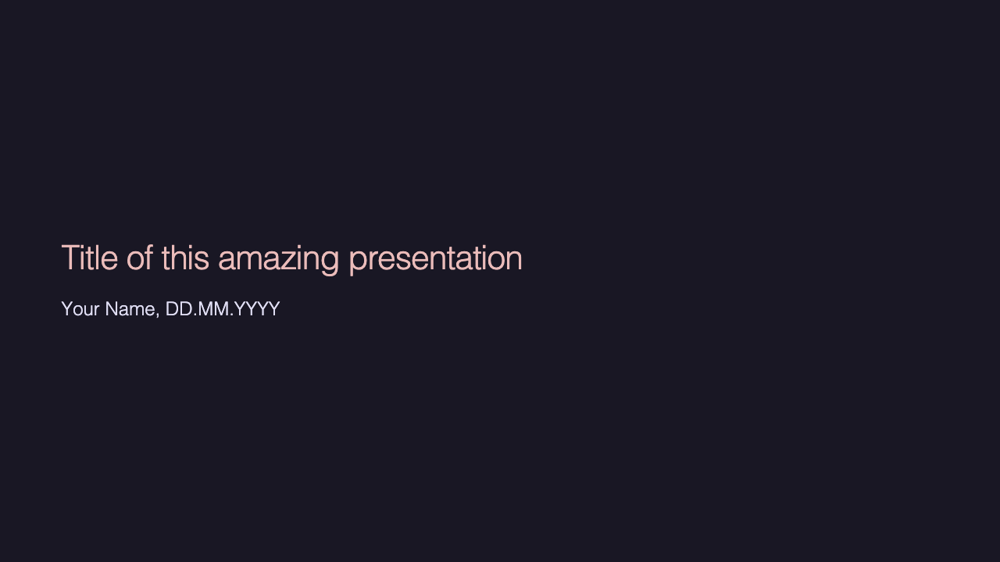
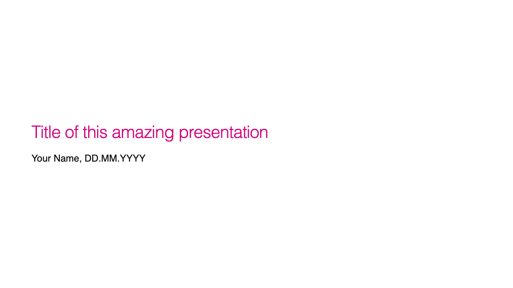
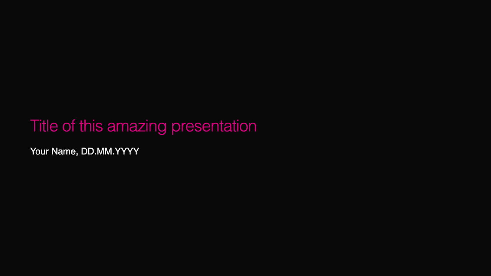
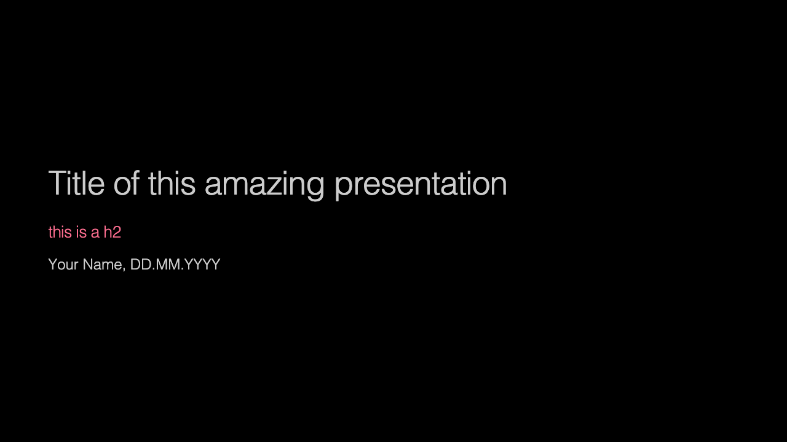

# marp

All you need for making slides in markdown using `marp`.


## Setup the environment

Add the list of `css` themes to `settings.json` of VSCode:
```
{
    "_comment": "Other settings...",
    "markdown.marp.themes": [
        "css/test.css",
        "css/rose-pine.css",
        "css/rose-pine-andrea.css",
        "css/pink.css",
        "css/pink.css",
    ],
}
```

Useful tools to install:
- [Marp extension for VSCode](https://marketplace.visualstudio.com/items?itemName=marp-team.marp-vscode)
    - In the extension settings, enable HTML.
- [Marp Slides](https://obsidian.md/plugins?id=marp-slides), a Marp plugin for [Obsidian](https://obsidian.md/)


## Create your presentation

How to:
- Copy the folder `css` to your workplace if you're working with the Marp extension for VSCode.
- Copy and reuse the slide deck `slides.md` for your presentation.

## CLI commands

Install command-line marp by following [these instructions](https://github.com/marp-team/marp-cli?tab=readme-ov-file#install).

Create html:
```
marp slides.md --theme css/pink.css
```

Create pdf:
```
marp slides.md --theme css/pink.css --pdf --allow-local-files
```

Open preview:
```
marp slides.md --theme css/pink.css --preview
```

## Examples

### Markdown code

```
---

# Title of this amazing presentation

Your Name, DD.MM.YYYY
```

### Generated slide for different themes

`rose-pine-andrea`

 

`pink`

 

`pink-dark`

 

`black`

 