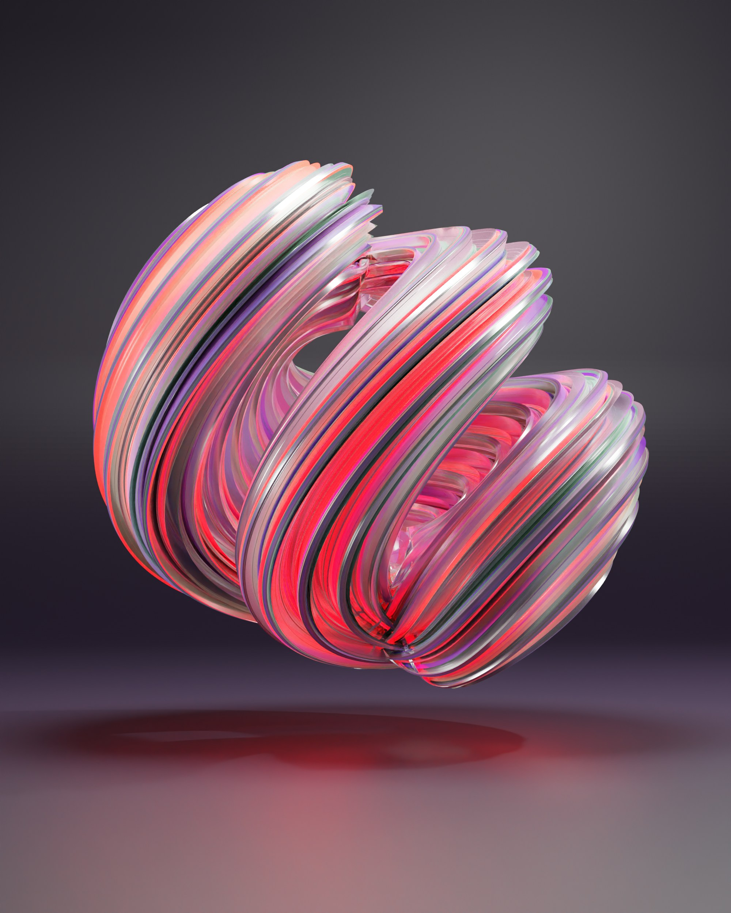

# Title of this amazing presentation

Your Name, DD.MM.YYYY

---

# This is an awesome title

**Lorem ipsum dolor sit amet**, consectetur adipiscing elit. Ut convallis orci eget commodo volutpat. Suspendisse quis vulputate sapien. Mauris eget neque sem. Aliquam aliquet aliquam arcu, sit amet elementum enim ullamcorper in.

[This is a link](https://youtu.be/dQw4w9WgXcQ?si=RXYrD8JF9gv6tEqN). Integer sit amet purus malesuada, volutpat ipsum sed, interdum metus. Donec at convallis ex. Mauris non ante nibh. *Duis id mollis elit. Donec egestas magna ut mi dictum, sit amet accumsan lorem blandit*.

A list:
- Sed eleifend dolor nisl, vitae rutrum lacus tempus eget.
- Cras fermentum auctor mi, nec rutrum augue varius in. Curabitur sodales tellus nisi. Nam volutpat, diam a sagittis eleifend, nulla est gravida purus, at semper augue tellus vitae ipsum.
- Cras et nunc magna.

---

# Let's try to fit a very long title, to see how the new line is generated

## The same can be done for h2. Let's try to fit a very long sentence, to see how the new line is generated


---

# And now a table

This is a cool table:

| Tables                                                                                            | Are                                                                   | Really                               | Cool                                                                                               |
| ------------------------------------------------------------------------------------------------- | --------------------------------------------------------------------- | ---------------------------------- | ------------------------------------------------------------------------------------------------- |
| Lorem ipsum dolor sit amet, consectetur adipiscing elit. Ut convallis orci eget commodo volutpat. | Suspendisse quis vulputate sapien.                                    | Mauris eget neque sem.             | Aliquam aliquet aliquam arcu, sit amet elementum enim ullamcorper in.                             |
| Aliquam aliquet aliquam arcu, sit amet elementum enim ullamcorper in.                             | Mauris eget neque sem.                                                | Suspendisse quis vulputate sapien. | Lorem ipsum dolor sit amet, consectetur adipiscing elit. Ut convallis orci eget commodo volutpat. |
| Suspendisse quis vulputate sapien.                                                                | Aliquam aliquet aliquam arcu, sit amet elementum enim ullamcorper in. | Mauris eget neque sem.             | Lorem ipsum dolor sit amet, consectetur adipiscing elit. |


---

# Some code


This is some code:
```bash
sudo install my-awesome-software
```

And then you can also use `my_package` in a sentence.


More code:
```python
def my_function():
  print('Hello')
  a = 1
  b = a + 2
```


---

# Headers

Typically, I would expect to have only H1 and H2 in a slide.

## First subsection

Lorem ipsum dolor sit amet, consectetur adipiscing elit, sed do eiusmod tempor incididunt ut labore et dolore magna aliqua. Ut enim ad minim veniam, quis nostrud exercitation ullamco laboris nisi ut aliquip ex ea commodo consequat.

## Second subsection

Lorem ipsum dolor sit amet, consectetur adipiscing elit, sed do eiusmod tempor incididunt ut labore et dolore magna aliqua. Ut enim ad minim veniam, quis nostrud exercitation ullamco laboris nisi ut aliquip ex ea commodo consequat.


---

## Takeaway one
Lorem ipsum dolor sit amet, consectetur adipiscing elit, sed do eiusmod tempor incididunt ut labore et dolore magna aliqua. Ut enim ad minim veniam, quis nostrud exercitation ullamco laboris nisi ut aliquip ex ea commodo consequat.

## Takeaway two
Lorem ipsum dolor sit amet, consectetur adipiscing elit, sed do eiusmod tempor incididunt ut labore et dolore magna aliqua. Ut enim ad minim veniam, quis nostrud exercitation ullamco laboris nisi ut aliquip ex ea commodo consequat.

## Takeaway three
Lorem ipsum dolor sit amet, consectetur adipiscing elit, sed do eiusmod tempor incididunt ut labore et dolore magna aliqua. Ut enim ad minim veniam, quis nostrud exercitation ullamco laboris nisi ut aliquip ex ea commodo consequat.


---

# Multi columns in Marp slide

## 2-column table:

<div class="columns" style="--cols: 2;">

  <div>

  **Column 1**

  Lorem ipsum dolor sit amet consectetur adipisicing elit.

  </div>
  <div>

  **Column 2**

  Tempore ad exercitationem necessitatibus nulla, optio distinctio illo non similique?

  </div>
  
</div>


## 3-column table:

<div class="columns" style="--cols: 3;">

  <div>

  **Column 1**

  </div>

  <div>

  **Column 2**
  
  </div>

  <div>

  **Column 3**
  
  </div>

  <div>
  
  Some text
  
  </div>
  
  <div>
  
  More text
  
  </div>

  <div>
  
  Did I forget any text?
  
  </div>

</div>


---

# Playing with colors
 
One can write a <span style="color:var(--gold);">gold</span> word.

One can write a <span style="color:var(--love);">love</span> word.

One can write a <span style="color:var(--rose);">rose</span> word.

One can write a <span style="color:var(--pine);">pine</span> word.

One can write a <span style="color:var(--iris);">iris</span> word.


---

# Text of different font sizes

<span class="large-text">This is large text.</span>
This is normal text.
<span class="small-text">This is small text.</span>

<br>

Let's now mix <span class="large-text">large text</span>, normal text, and <span class="small-text">small text.</span>


---

# Images

  

<br>

Photos by <a href="https://unsplash.com/@designingsucks?utm_content=creditCopyText&utm_medium=referral&utm_source=unsplash">Nikhil Dafare</a> on <a href="https://unsplash.com/photos/a-close-up-of-a-colorful-ball-idVUh309DvA?utm_content=creditCopyText&utm_medium=referral&utm_source=unsplash">Unsplash</a>


---

# Image with border and shadow

Photo by <a href="https://unsplash.com/@kalenemsley?utm_content=creditCopyText&utm_medium=referral&utm_source=unsplash">Kalen Emsley</a> on <a href="https://unsplash.com/photos/green-mountain-across-body-of-water-Bkci_8qcdvQ?utm_content=creditCopyText&utm_medium=referral&utm_source=unsplash">Unsplash</a>

<br>

<center>


</center>


---

# Full-bleed image

Next slide...

Photo by <a href="https://unsplash.com/@kalenemsley?utm_content=creditCopyText&utm_medium=referral&utm_source=unsplash">Kalen Emsley</a> on <a href="https://unsplash.com/photos/green-mountain-across-body-of-water-Bkci_8qcdvQ?utm_content=creditCopyText&utm_medium=referral&utm_source=unsplash">Unsplash</a>
      

---

<div class="full-bleed">
  
</div>


